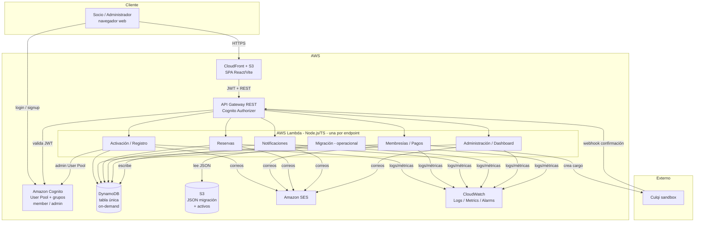

# Arquitectura base — Activa Club

> Documento de arquitectura de alto nivel del MVP. Derivado del
> [Contexto Maestro](../product/contexto-maestro.md), la
> [Visión](../product/vision-y-objetivos.md) y las
> [Reglas de negocio](../product/reglas-de-negocio.md). Las decisiones puntuales
> se justifican en los [ADRs](./adr/). Si hay conflicto, prevalece el Contexto
> Maestro.

## 1. Principios rectores

1. **Serverless primero**: sin servidores que administrar; se paga por uso. El
   sistema se presenta a un jurado con pocos usuarios, por lo que el objetivo es
   costo casi nulo en reposo.
2. **Bajo costo y simplicidad**: se evita la sobrearquitectura. Una tabla
   DynamoDB, una función Lambda por endpoint, un solo pool de Cognito.
3. **Seguridad por defecto**: autenticación gestionada por Cognito, autorización
   por rol en el backend, nunca en el frontend. Sin secretos en el repositorio.
4. **Reglas críticas en el backend**: aforo, cruces, deuda, cancelación 24h,
   aprobación de recursos, idempotencia de pagos e límites de invitados se
   validan siempre del lado servidor (ver [reglas de negocio](../product/reglas-de-negocio.md)).
5. **Contratos antes de implementar**: `docs/api/` y `packages/shared-types`
   definen la interfaz; frontend y backend avanzan en paralelo.
6. **Infraestructura como código**: todo recurso AWS vive en Terraform
   (`infrastructure/terraform`), sin cambios manuales en consola.

## 2. Componentes AWS del MVP

| Capa | Servicio AWS | Responsabilidad | ADR |
|------|--------------|-----------------|-----|
| Frontend | S3 + CloudFront | Hosting estático del SPA React/Vite (build) y distribución HTTPS | ADR-0005 |
| Autenticación | Amazon Cognito (User Pool + grupos `member`/`admin`) | Registro, login (correo+contraseña), emisión de JWT, recuperación de contraseña | ADR-0002 |
| API | Amazon API Gateway (REST) | Puerta de entrada HTTP, validación de JWT vía Cognito Authorizer, enrutamiento a Lambda | ADR-0004 |
| Cómputo | AWS Lambda (Node.js 20 + TypeScript) | Lógica de negocio; una función por endpoint | ADR-0004 |
| Datos | Amazon DynamoDB (single-table, on-demand) | Fuente operativa: socios, membresías, pagos, reservas, recursos, notificaciones, auditoría | ADR-0003 |
| Almacenamiento | Amazon S3 | JSON de migración on-premise y activos del sistema | ADR-0005 |
| Correo | Amazon SES | Correos transaccionales (activación, pagos, reservas, etc.) | ADR-0006 |
| Pagos | Culqi (sandbox) | Cobro con tarjeta; el backend crea el cargo server-side | ADR-0007 |
| Observabilidad | Amazon CloudWatch (Logs + Metrics + Alarms) | Logging estructurado, métricas, alarmas | ADR-0008 |
| IaC | Terraform | Aprovisionamiento reproducible de todo lo anterior | (US-004) |
| CI/CD | GitHub Actions (OIDC → AWS) | Lint, typecheck, test, build y despliegue | (US-005) |

## 3. Diagrama de contexto (MVP)

## 4. Flujos clave (resumen)

### 4.1 Migración on-premise (RN-MIG)
1. Se sube el JSON mock a S3 (`mock-data/` versionado en repo; el artefacto real
   se coloca en el bucket de migración).
2. Una Lambda operacional (`LM`) lee el JSON, valida y hace `BatchWrite` a
   DynamoDB creando ítems `Member` con `legacyId`, membresía y saldo pendiente
   resumido. Es **idempotente**: reejecutar no duplica socios (condición sobre
   claves de unicidad de DNI). Ver [mapeo de migración](../data/mapeo-migracion.md).
3. Tras migrar, DynamoDB es la fuente operativa (RN-MIG-06).

### 4.2 Activación de socio migrado (RN-ACT)
1. El socio ingresa su DNI → `POST /activation/verify` valida contra la data
   migrada (unicidad de DNI, no activado previamente).
2. `POST /activation/complete` con correo+contraseña crea el usuario en Cognito
   (grupo `member`), enlaza `cognitoSub` con el socio y lo deja `ACTIVE` si su
   membresía migrada está vigente. Un DNI = una sola cuenta digital (RN-ACT-03).

### 4.3 Registro de socio nuevo (RN-ACT-05..07)
1. `POST /registration` crea el socio en estado `PENDING` y el usuario Cognito.
2. Admin aprueba/rechaza (`POST /members/{id}/approve|reject`).
3. Tras aprobación, el socio debe pagar su primera membresía para pasar a
   `ACTIVE` y poder reservar.

### 4.4 Pago con Culqi (RN-PAG)
1. El frontend tokeniza la tarjeta con Culqi.js (los datos de tarjeta nunca
   tocan el backend).
2. `POST /payments` envía el token + `idempotencyKey`. El backend crea el cargo
   server-side, con item de idempotencia en DynamoDB (RN-PAG, ADR-0007).
3. El estado de membresía solo se actualiza al confirmar el resultado de forma
   segura (respuesta síncrona verificada y/o webhook firmado, RN-PAG-07).

### 4.5 Reserva (RN-RES)
1. `GET /resources/{id}/availability` calcula franjas libres.
2. `POST /reservations` valida en backend: socio activo sin deuda (RN-RES-12),
   horario/aforo del recurso, ausencia de cruces por recurso (RN-RES-07) y de
   superposición de participantes (RN-RES-08), y límite de 2 visitas/mes por
   invitado externo (RN-RES-05). Fútbol/tenis/pádel/piscina se confirman
   automáticamente; parrillas/salón social quedan `PENDING_APPROVAL`.
3. Cancelación permitida hasta 24h antes (RN-RES-10).

### 4.6 Notificaciones (RN-NOT)
- Notificación interna: item por socio en su inbox de DynamoDB (obligatorio).
- Correo transaccional opcional vía SES para eventos relevantes.

## 5. Límites entre capas

- **Frontend (`apps/web`)**: presentación y validación de UX. No decide reglas
  críticas; solo consume contratos y muestra estados. Usa `packages/shared-types`
  y `packages/validation`.
- **Backend (`apps/api`)**: única autoridad sobre reglas de negocio, autorización
  por rol y persistencia. Valida toda entrada con los esquemas de
  `packages/validation`.
- **Datos (DynamoDB)**: modelo single-table gobernado por
  [modelo-dynamodb.md](../data/modelo-dynamodb.md). Ningún nombre de tabla,
  atributo o índice se usa sin documentarse ahí primero.
- **Infra (Terraform)**: define recursos, permisos IAM de mínimo privilegio,
  variables por entorno. No contiene lógica de negocio.

## 6. Entornos

Dos entornos para el MVP: `dev` (desarrollo) y `demo` (presentación al jurado).
Aislados por prefijo de nombre de recurso y cuenta/variables. Ver
[ADR-0001](./adr/ADR-0001-estrategia-entornos.md).

## 7. Seguridad transversal

- JWT de Cognito validado en API Gateway; claim de grupo (`cognito:groups`)
  determina rol.
- IAM de mínimo privilegio por Lambda (solo las acciones DynamoDB/SES/S3 que usa).
- Sin contraseñas, datos de tarjeta, CVV ni secretos de Culqi en DynamoDB
  (RN-PAG-08). Secretos en AWS SSM Parameter Store / Secrets Manager, inyectados
  por variables de entorno.
- Ver [docs/security](../security/) para el detalle de roles y permisos.

## 8. Evolución prevista

- **Múltiples administradores**: el rol se modela como grupo de Cognito y como
  atributo, no hardcodeado; agregar administradores no requiere cambio de esquema
  (ver ADR-0002).
- **Fases posteriores** (lista de espera, QR, WhatsApp, IA): fuera del MVP;
  el modelo de datos deja espacio (atributos extensibles) sin implementarlas.

## 9. Referencias

- [ADRs](./adr/)
- [Riesgos técnicos](./riesgos-tecnicos.md)
- [Modelo de datos DynamoDB](../data/modelo-dynamodb.md)
- [Contratos de API](../api/contratos-api.md)
</invoke>
